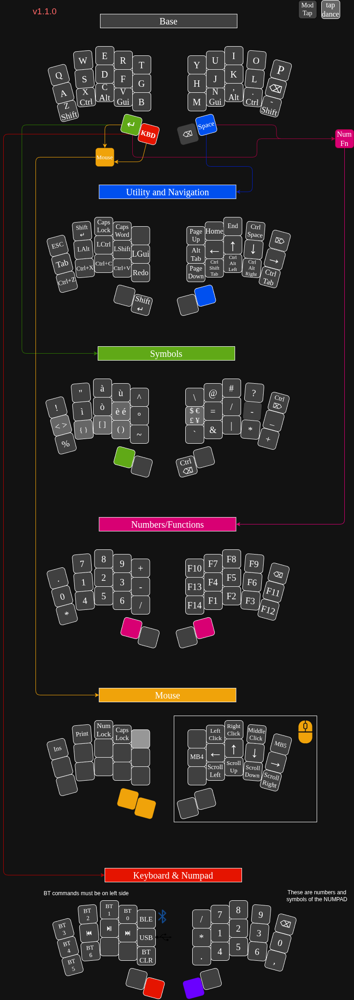

# Zampone

ZMK config for the **Zampone** layout: the essential variant of
[Cotechino_34](https://github.com/fractalysid/zmk-config-cotechino_34) for
**Demetra v2**, a custom wireless 34-key split keyboard (nRF52840/BMD-340,
ZMK board module
[`zmk-keyboard-demetra_v2`](https://github.com/fractalysid/zmk-keyboard-demetra_v2)).

Compared to Cotechino_34: **QWERTY** base layer instead of Colemak-DH, only
the six essential layers (default, utility, symbols, num/fn, keyboard, mouse),
no macros, no combos and **no secret files** — it builds as-is.



The diagram source is [`Zampone.drawio`](Zampone.drawio).

> **Note — ZMK Studio:** this layout targets ZMK v0.3 and does **not** include
> ZMK Studio support (there is no `&studio_unlock` key, which only exists on
> ZMK v0.4+). For the Studio-enabled variant of this same keymap, see the
> user config template
> [zmk-config-demetra_v2](https://github.com/fractalysid/zmk-config-demetra_v2).

## Layers

- **default** — QWERTY, hold-tap mods on the bottom row, tap-dances for accented letters
- **utility** — navigation, sticky mods, shortcuts (hold Space)
- **symbols** — Italian-layout symbols, paired delimiters and currencies as tap-dances (hold Return)
- **num/fn** — numbers and F1-F14 (utility+symbols)
- **keyboard** — bluetooth, media, numpad
- **mouse** — pointer and scroll (symbols+keyboard)

## Build

From the Keyboards workspace (see [kb-build](https://github.com/fractalysid/kb-build)):

```bash
LAYOUT=Zampone ./build-demetra.sh             # both halves, ZMK v0.3
ZMK_DIR=upstream/zmk/v0.4 LAYOUT=Zampone ./build-demetra.sh   # ZMK v0.4 (HWMv2)
```

The UF2 files land in `artifacts/demetra_v2/`.
